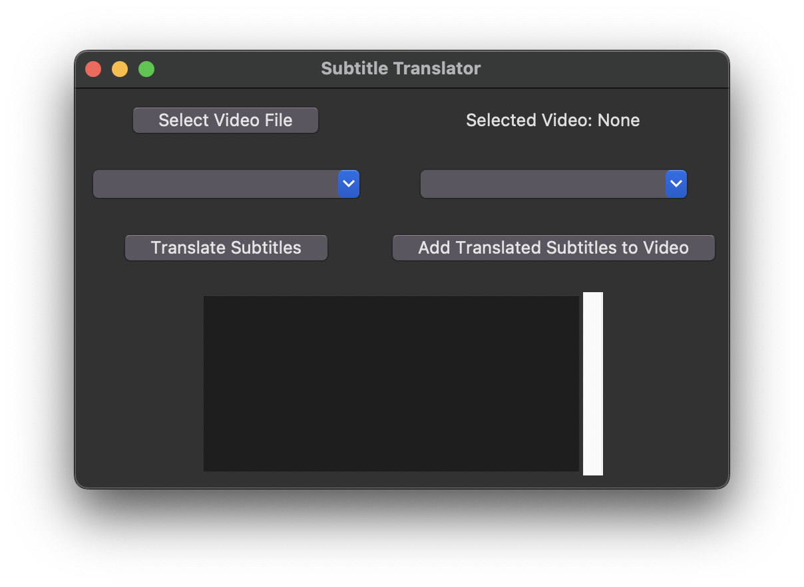
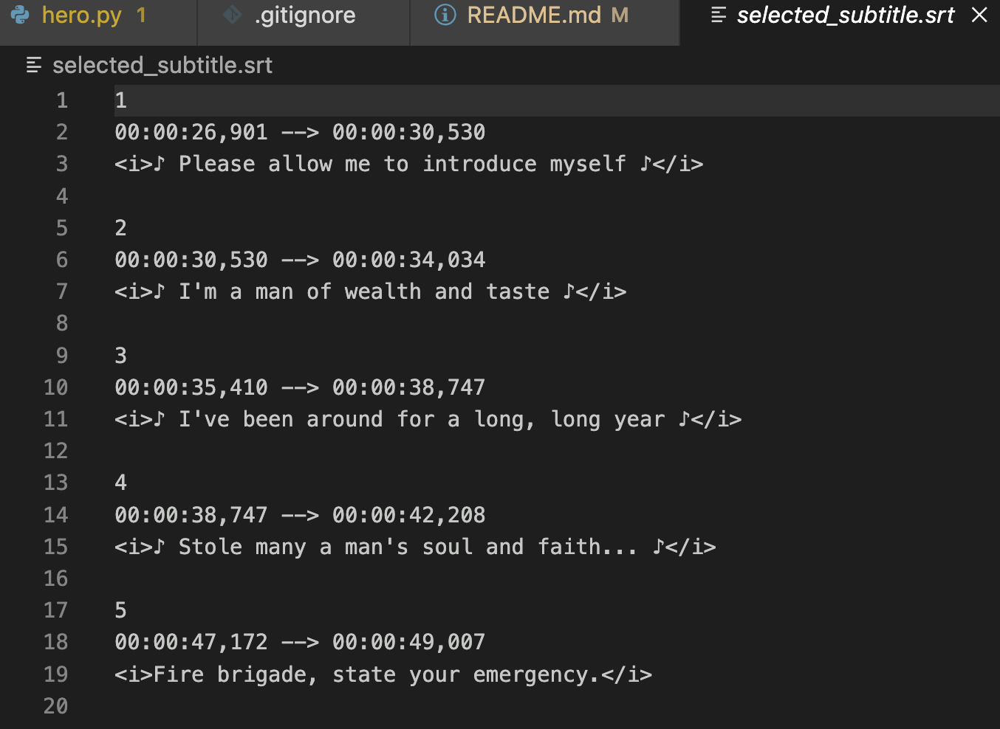
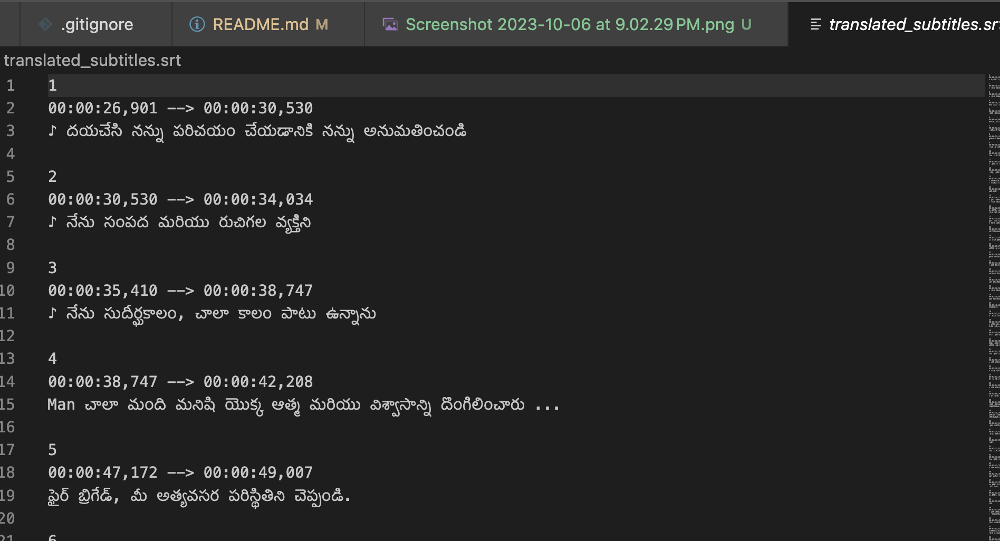
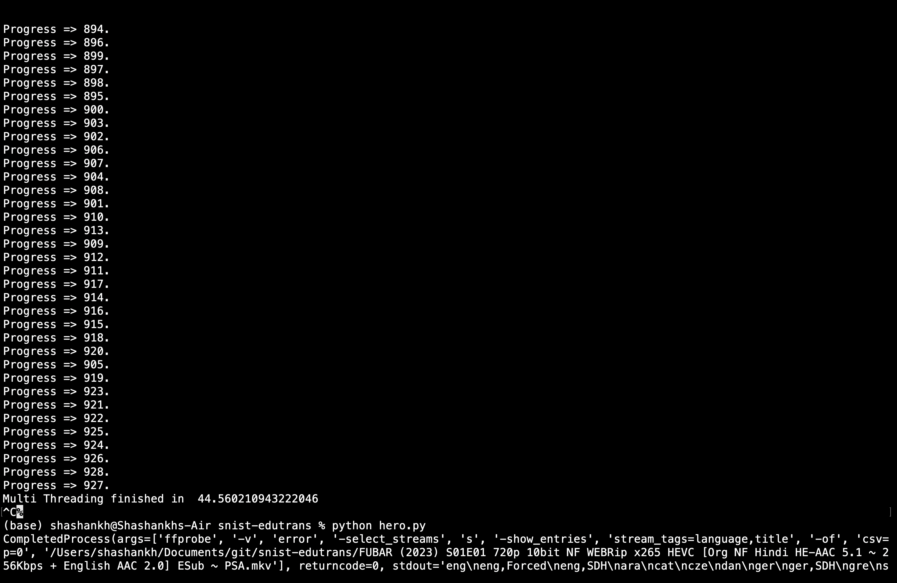

# snist-edutrans

## Made using FFMPEG, Python, GoogleTrans, tkinter
## Efficient subtitle translation and addition for any language video files

# Screenshots

## The following tests were done on CS50 (1.5 Hour length video) 
### Single threading

### Multithreading threading
