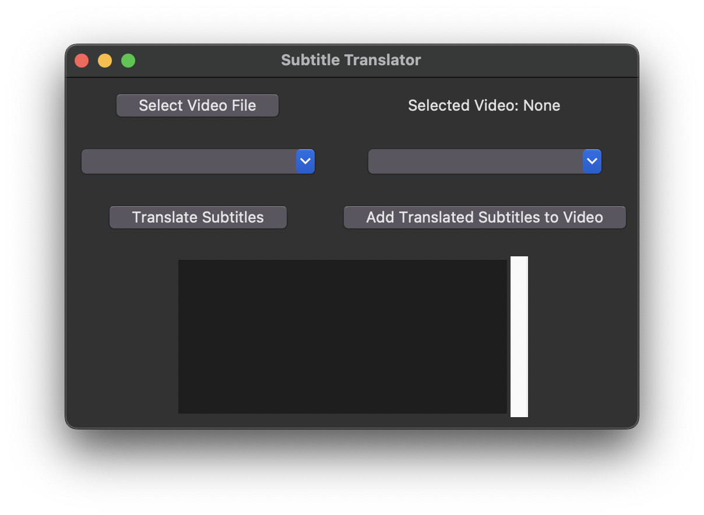
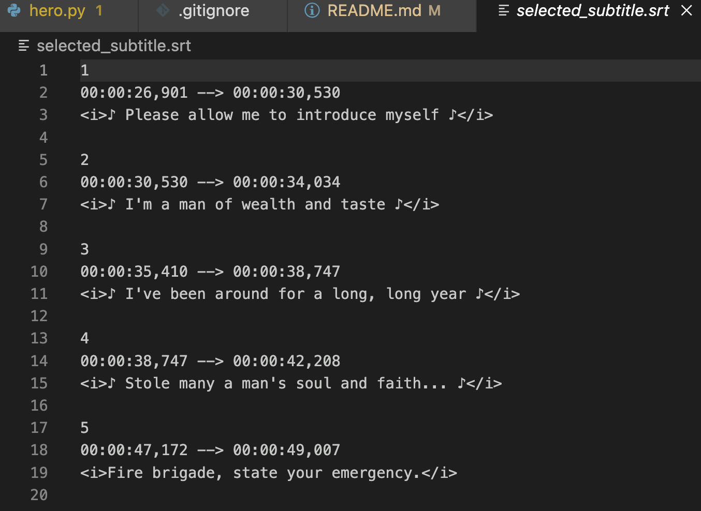
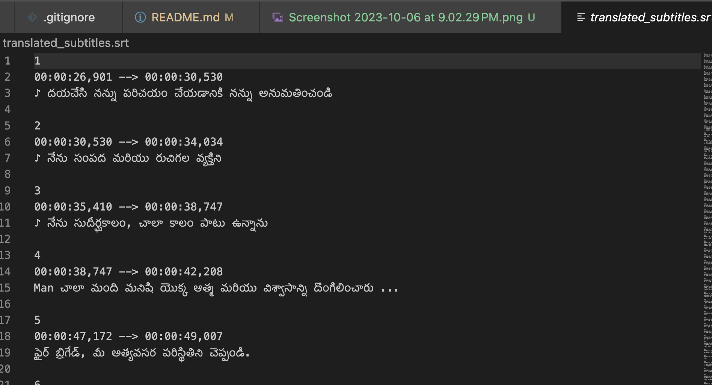
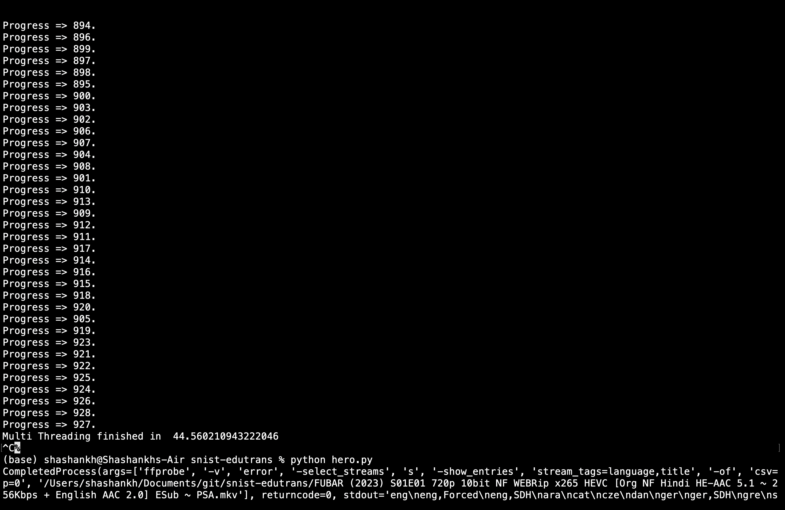
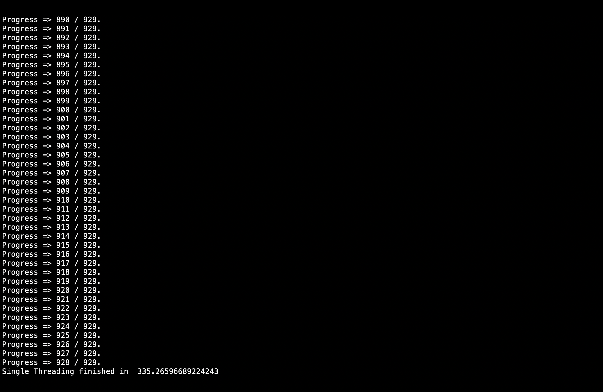

# snist-edutrans
### Made using FFMPEG, Python, GoogleTrans, tkinter

# Screenshots

# Demo

## The following tests were done on CS50 (1.5 Hour length video) 
### Multithreading  threading

### Single threading
